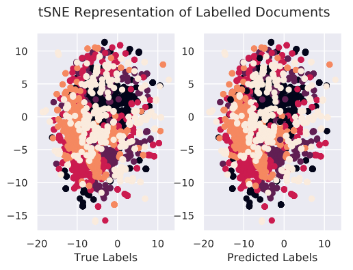

## Gibbs Sampling For The Uninitiated
This is a Python implementation of the excellent [Gibbs Sampling For The Uninitiated](https://drum.lib.umd.edu/bitstream/handle/1903/10058/gsfu.pdf?sequence=3&isAllowed=y).
**sampler.py** contains the actual Gibbs sampling implementation.
The Jupyter notebook **labeller.ipynb** demonstrates the working of a Gibbs sampler to classify articles between five classes.

  

